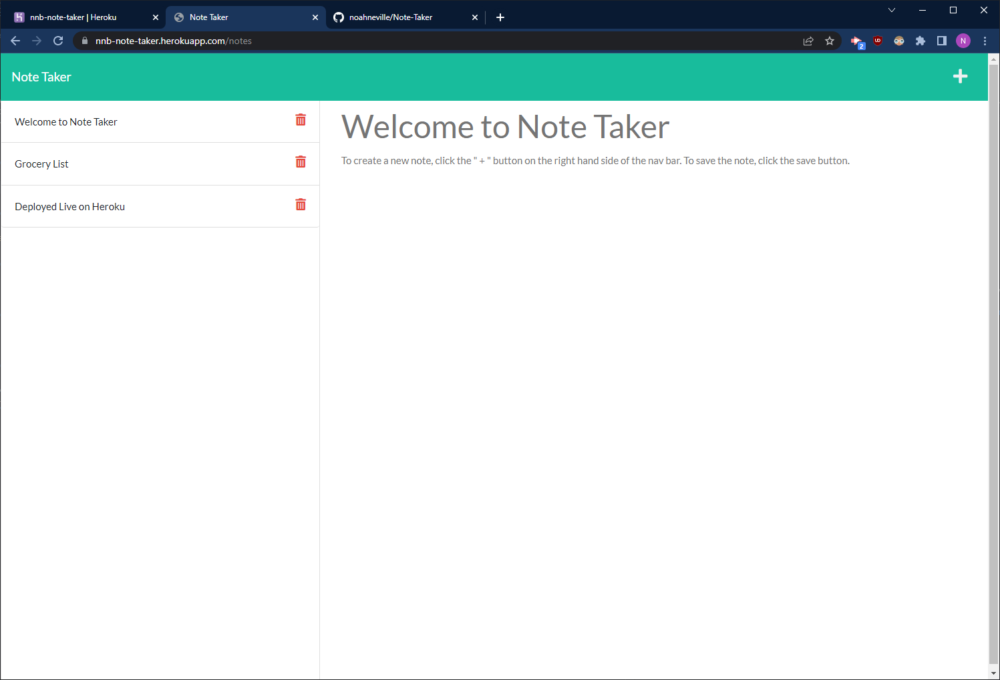

# Note Taker
  
  
  ## Description
  a simple full stack application that allows you to write and save notes to the web.
  
  ## Table of Contents
  * [Installation](#installation)
  * [Usage](#usage)
  * [License](#license)
  * [Questions](#questions)

  ## Installation

  The page can be viewed and used live at [Heroku](https://nnb-note-taker.herokuapp.com/)

  Alternatively, you can clone the repo from [Github](https://github.com/noahneville/note-taker) and run it locally on your machine. To do so, clone the repo and open that folder in your terminal of choice. Enter 'npm i' to install all necessary libraries, then enter 'node server.js' to run the application locally.
  

  ## Usage
   
   Here's an example of the deployed web app:

   

   Technologies used to build this site:
    
  - Node.js
  - Express.js
  - nanoid

  ## License
  

  ## Acknowledgements 

  Heroku for hosting the site

  Dan Ringenbach for helping me modularize my routes and helper functions

  My study group members: 
  - Seamona Stewart
  - Brian Samuels
  - James Edwards
  - Lina Choi
  - Anthony Chang

  ## Questions
  Thanks for checking out my project. You can check out my GitHub profile [here.](www.github.com/noahneville)

  If you have any further questions, feel free to email me at noahneville@gmail.com
